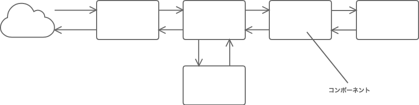
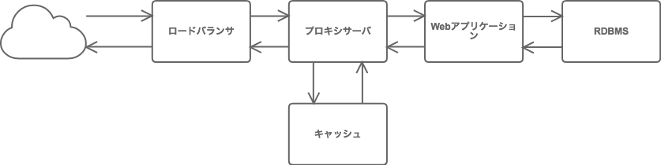
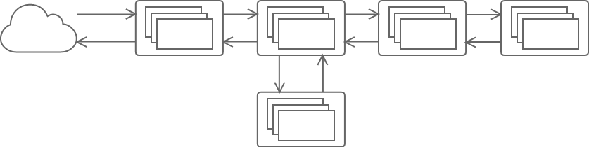
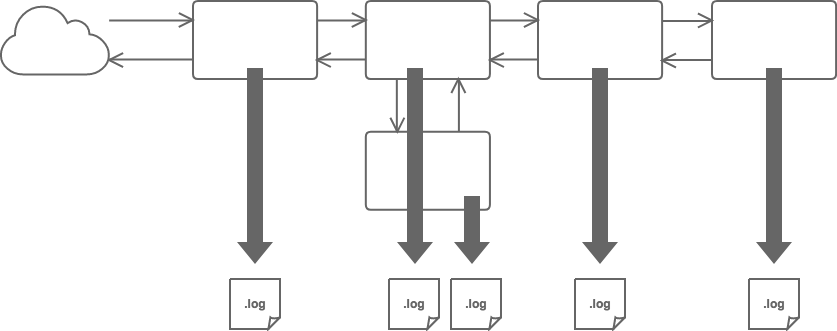
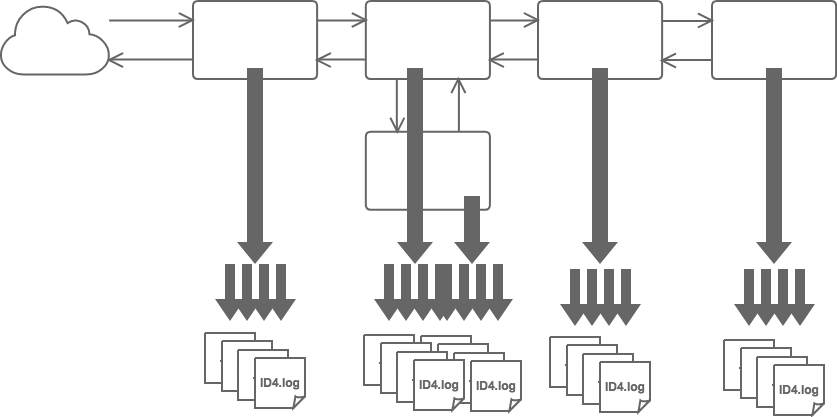
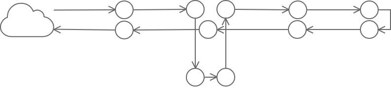
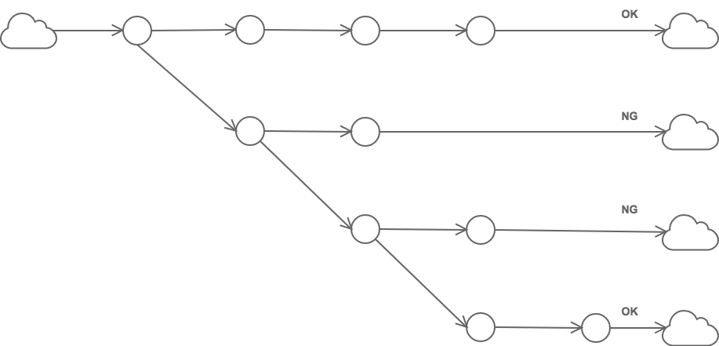

# サービスやアーキテクチャを考慮したパス構造を用いたログ保存について

Webサーバやアプリケーションなどのログの出力は時系列に1次元で出力されるのが主です。

ログはただ収集すれば良いわけではなく、最終的には統計や分析、サービスの異常箇所の特定などに活用できる必要があります。

しかし現在は、実現したいサービスやサービスを構成するアーキテクチャの複雑化に伴い、

- 単純にサーバの台数が複数台になる
- マイクロサービス化が進むことによりログを出力するサービスを構成するコンポーネントの種類が増加する
- 1つのコンポーネントが出力するログの種類が複数になる

という状況から、それぞれから出力されたログをそれぞれ用いてサービスの状態を把握することが困難になってきています。

これに対応するために、Fluentdなどのログコレクタを用いたログの集約保存が一般化してきたり、AWS X-Rayなどの分散トレーシングへの注目が高まっていると考えられます。

筆者は上記のようなツールを使うと同時に、実は、ログの保存や抽出の手法も、データベースと同じように「あらかじめサービスやアーキテクチャに沿った設計をするということ」がそれぞれの現場で進んでいるのではないかと考えています。

本稿では、まず筆者が対象としているサービスの大まかなアーキテクチャを共有します。

次に、ログ設計において何を実現したいかといった、本稿での議論の範囲を共有します。

そして、筆者が検討を進めている「パス構造を用いたログ保存」について議論をしたいと考えています。

## 対象としているサービスのアーキテクチャ

本稿では入力としてのリクエストと出力としてレスポンスを対として持つWebアプリケーションを対象とします。

また、Webアプリケーションは複数のコンポーネントから構成されています。

例としてそれぞれのコンポーネントにロールをつけるとすると、例えば以下のようなイメージです。

また、それぞれのコンポーネントはLVSやKeepalived、AutoScalingなどで多重化されているものとします。

Webアプリケーションでは、ユーザやプロジェクトなどのユニークなIDがあり、ログをそれらでグルーピングできるものとします（以下プロジェクトID）。

それらサービスの構成やそれぞれのコンポーネントの動きはログの設計者にとって既に明らかであるとします。

## 本稿の議論の範囲

### ログ設計によって実現したいこと

ログの利用方法には以下のような利用方法があります。

1. サービスの定量的計測
2. サービスを構成するコンポーネントの意図しない動作（遅延やバグなど）の特定

本稿では主に2を対象を考えています。

### アプローチ

サービスから出力される複数種類ログ群からある特定の情報を抽出したいとき、以下の2つの点を考える必要があります。

1. 保存時にログをどのように正規化するか
2. 保存されたログをどのように抽出するか
	- grep
    - BigQueryのクエリエンジン

また、1のログの正規化についても大きく以下の2つに分類できると思います。

- 1-a. 最小粒度のログをどのように正規化するか（最小粒度:  Apacheのアクセスログにおける1アクセスで出力されるログなど）
	- Apache HTTPD Combined Log Format
    - LTSV
- 1-b. 複数種類のログ群をサービスやアーキテクチャを考慮してどのように正規化して保存するか

本稿で議論したい範囲は1-bになります。

つまり、「どのような構造でログを保存しておけば、サービスに意図しない動作が発生したときに素早く原因特定に至ることができるだろうか」という点について議論をしたいと考えています。

## パス構造を用いたログ保存

筆者は、現在対象サービスに対して、パス構造（ディレクトリ構造やファイル名）を用いたログ保存を検討しています。

パス構造を用いたログ保存について簡単な例を説明します。

従来のログは以下のようにコンポーネントごとに保存されていると思います。

例えば各コンポーネントごとのログをプロジェクトIDごとにファイルを分割してプロジェクトIDを付与して保存するだけで、任意プロジェクトIDで発生した不具合の特定が早くなります。

また、筆者が開発している[faultline](https://github.com/faultline/faultline)というエラートラッキングツールにおいても、1つのエラーログの保存を `/projects/{プロジェクト名}/errors/{エラーメッセージ}/occurrences/{時刻}.json` というパス構造で保存することによって、任意のエラーの絞り込みとエラーの詳細情報の取得を簡単にしています。

つまり、ファイル名というパス構造にIDというサービスの特性を考慮した情報を付与することで、不具合特定における情報量を大きくするというアイデアです。

### パス構造を用いたログ保存のメリット

筆者がなぜパス構造を用いたログ保存を考えているかというと以下のメリットがあると考えているからです。

- Linuxのファイルシステム上で実現可能
    - 導入が簡単
- パス構造のルールをうまく設定することで、非同期でログ収集が可能になる
- AWS S3などのオブジェクトストレージの利用を視野にいれることができる

### 対象としているサービスのアーキテクチャの特性

対象としているサービスのアーキテクチャは、以下のような特性を持っていると考えています。

1. サービスが正常であるとき、任意のリクエストは各コンポーネントを正しく情報が伝搬し（以下、イベントの伝搬）最終的に正しくレスポンスを返していること
	- 「正しく伝搬するルート」は1種類とは限らない
2. あるレスポンスが正常でないとき、そのレスポンスに絞ったリクエスト-レスポンス間のログから不具合を特定できる可能性が高い
3. （例えば）HTTPリクエストにおけるステータスコードを正しく返せているとは限らない（バグの場合、正しくない状況で200を返す可能性もある）

上記のようなサービスにおいて、パス構造に情報を持つログ保存を考えてみます。

#### リクエストからレスポンスまでのイベントの伝搬のパスをパス構造に持つ

対象アーキテクチャは、リクエストからレスポンスまでのイベントの伝搬は有向グラフに置き換えることができます。

また、リクエストを投げるときのコンポーネントとレスポンスを受け取るときのコンポーネントを別の頂点と考えると、正常、異常に関わらずリクエストからレスポンスまでをツリー構造におさめることができます。

上記の特性を利用して有向グラフにおける辺の情報をパス構造に持ってみます。

- まず各コンポーネントに固定長のIDを振ります。
- リクエストタイミングでプロジェクトIDとリクエスト時刻とトレースIDを付与します。
- コンポーネントを通る度にリクエストヘッダなどにコンポーネントIDを追記します。
- 各コンポーネントで発生するログの保存パスは `{プロジェクトID}/Y/m/d/H/{リクエスト時刻}_{トレースID}_{コンポーネントID}_..._{コンポーネントID}.log` となります。

「正しく伝搬するルート」が任意の種類しかない場合、「ある時刻付近のあるプロジェクトの調子がおかしい」というときに、まずどのコンポーネントでイベントの伝搬がうまくいかなかったかをパスの長さやパス名から絞り込みできます。

### まとめ

筆者は、ログ保存の方法についてもデータベースのように「あらかじめサービスやアーキテクチャに沿った設計をする流れがあるのではないか」と考えており、本稿ではその一手法として「パス構造を用いたログ保存」というアイデアについて一例を示しました。

残念ながら既存手法の調査などはできておらず、おそらく何かしらより有効な手法があるのかもしれません。

今回、上記のようなアイデアのそもそも可否だけではなく、既にある手法や、上記以外のログ保存における正規化の手法についても知見が得られればと考えています。
